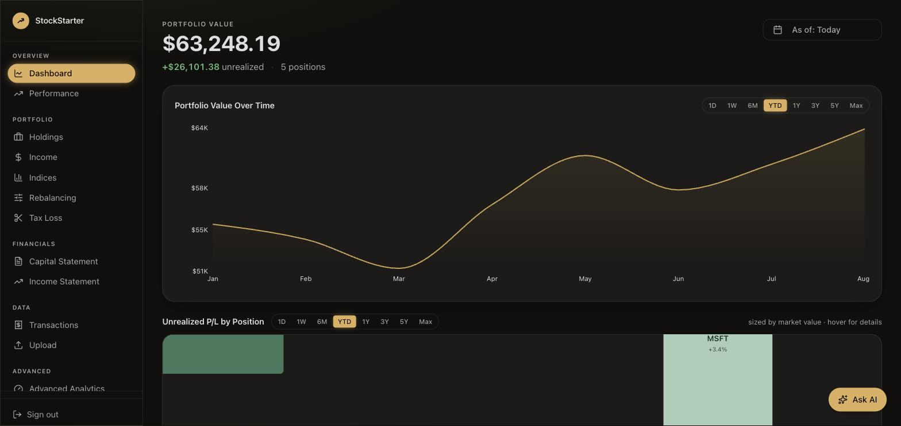
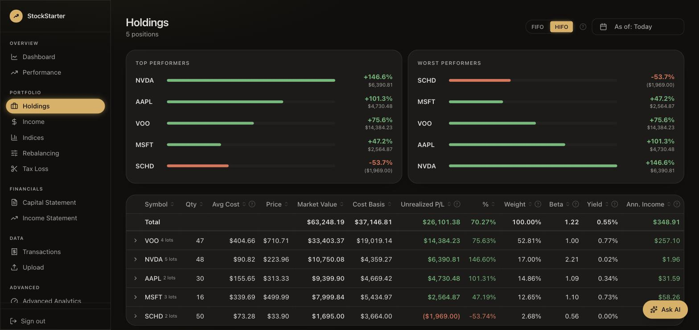

# StockStarter

A beginner-friendly stock portfolio tracker that never leaves your browser. Upload a broker export and get real holdings, performance, income, and tax-loss insight — without needing to understand a brokerage statement to read it, and without handing your holdings to a server anywhere.

Reads broker export files (Excel or CSV), resolves holdings, fetches live prices from Yahoo Finance, and delivers analytics across performance, income, risk, and taxes. No account, no login, nothing to install — your transactions are parsed in the browser and stored in `localStorage` on your own device. Accessible on web and mobile.

**[Live demo →](https://stockstarter-production.up.railway.app)** — no signup, just upload a statement (a synthetic one is fine — nothing you upload leaves your browser)



---

## Why this exists

Brokerage dashboards show you a number and stop there — no explanation of what it means, whether it's good, or what it costs you to not know. StockStarter starts from the same broker export you already have and builds the layer a brokerage has no incentive to build: real accounting (a balanced Balance Sheet, General Ledger, and Income Statement derived entirely from your transaction history, not just a portfolio value ticker), and a plain-English explanation attached to every metric that isn't self-evident — what Beta means, why FIFO and HIFO give you different tax numbers for the same sale, what a wash sale actually disallows.

**The hardest part** turned out to be invisible in a demo: Yahoo Finance has no official API, and a single page load was firing a dozen-plus uncached requests for a handful of symbols — enough to trip its rate limit almost immediately. The failure mode was worse than a loading spinner: a rate-limited quote silently defaulted to $0, so a real portfolio would render as "down 100%" with no indication anything was wrong, and in one code path an unhandled rejection from a failed request could crash the whole server process. Fixed with an in-process cache that de-dupes concurrent requests and shares a short-lived result across the app, plus a rule that a missing price falls back to cost basis (an honest "no change") instead of a fabricated loss, flagged visibly so it's never presented as live data.

**What I'd change**: the tax-loss and rebalancing pages give you real numbers but stop short of a "why this position" narrative the way the KPI tooltips do elsewhere — that's the next thing to close.

---

## Features



### Accounts
- One account per uploaded file — filename becomes the account name
- Sidebar account switcher: per-account views plus a consolidated "All accounts" view

### Dashboard
- Portfolio value over time (hybrid monthly/daily NAV chart)
- Holdings treemap with unrealized P&L coloring
- Allocation donut and sector breakdown
- Asset class bar chart
- Stat strip: total value, day change, portfolio beta, expected annual income

### Holdings
- Position table with avg cost, market value, unrealized P&L, beta, yield, and annual income
- Expandable tax lot rows (FIFO / HIFO toggle)

### Performance
- Time-weighted return (TWR) — removes distortion from contributions/withdrawals
- IRR (dollar-weighted, annualized)
- Benchmark overlay: S&P 500 or NASDAQ 100
- Sub-period breakdown table (one row per cash flow event)
- Performance attribution: $ gain/loss and contribution per position
- Risk metrics: annualized volatility, max drawdown, Sharpe ratio

### Income
- Dividend history per position pulled from Yahoo Finance
- TTM income, ex-dates, per-share amounts, shares held at record date

### Tax Loss Harvesting
- Full table sorted by largest unrealized loss
- Estimated tax savings at LT (20%) and ST (37%) rates
- Wash sale risk flag (buys within 30 days)

### Index Comparison
- Portfolio weight vs. S&P 500 or NASDAQ 100 weight, side by side

### Account Statement
- Period statement view with a date-range selector
- One-click PDF export

### AI Chat
- Ask questions about the portfolio in plain English
- Answers grounded in live holdings, prices, and transaction history
- Account-aware: ask about a specific account by name, or the whole portfolio

### Upload
- Drag-and-drop Excel or CSV import
- Auto-seeds CUSIP → ticker mappings; manual override via `/mappings`

---

## Access

Open the [live demo](https://stockstarter-production.up.railway.app) in any browser (desktop or mobile) and upload a statement — there's no account to create and nothing to install. The UI is responsive — on phones the nav collapses into a drawer, and "Add to Home Screen" makes it behave like an app.

Every account you upload lives only in that browser's `localStorage`, on that device. There's no server-side database of anyone's holdings — clearing your browser data or switching devices means starting over with a re-upload, which is the tradeoff for nothing ever being stored anywhere else.

New account data: upload an `.xlsx`/`.csv` file directly from `/upload`. Overwrite a file with the same name to update that account. "Clear all data" in the sidebar wipes everything on that device in one step.

---

## Stack

| Layer | Choice |
|---|---|
| Runtime | Bun v1.3.14 |
| Framework | TanStack Start v1.167 (Vite-native) + React 19 |
| Router | TanStack Router (file-based) |
| Storage | Browser `localStorage` for your transactions; server-side SQLite holds only a shared price cache |
| Styling | Tailwind v4 + shadcn/ui |
| Charts | Recharts |
| Excel parsing | SheetJS (client-side) |
| PDF export | jsPDF + jspdf-autotable |
| Prices | Yahoo Finance (no API key required) |
| AI | Anthropic Claude (Haiku) |
| Hosting | Any Bun-capable host — Dockerfile included, Railway-tested |

---

## Running locally (dev)

Requires [Bun](https://bun.sh) v1.3+.

```bash
git clone https://github.com/moff05/stockstarter.git
cd stockstarter
bun install
bun dev
```

Opens at `http://localhost:5173`. A small SQLite file is created at `data/portfolio.db` on first run — it's only a shared price cache; your uploaded transactions live in the browser, not this file.

**AI chat (dev mode):** Create a `.env` file in the project root:
```
ANTHROPIC_API_KEY=sk-ant-...
```
Bun loads this automatically. Get a key at [console.anthropic.com](https://console.anthropic.com).

---

## Deployment

The production build is a standalone Bun server (`server/server.mjs`) that serves the built client and the SSR/server-function handler — no login gate, since there's no user data on the server to protect. Build with `bun run build` (outputs `dist/client` + `dist/server`), then `bun run start` to serve it. A `Dockerfile` is included for any container host; `railway.json` is there if you deploy to Railway specifically.

**Environment variables:**

| Variable | Purpose |
|---|---|
| `ANTHROPIC_API_KEY` | AI chat (optional — the app runs fine without it, chat just won't respond) |
| `DB_PATH` | Path for the shared price cache — point this at a persistent volume if you want it to survive redeploys, though it's just a cache and rebuilds itself either way |

Anyone who can reach the deployed URL can use it — that's intentional, since every visitor's data stays local to their own browser and there's nothing shared to expose.

---

## Data & privacy

- Your broker export file is the source of truth. Transactions are parsed in the browser and stored in that browser's `localStorage` — they're never uploaded to a server or written to any database.
- The only server-side state is a shared cache of daily closing prices (public market data, not yours) and, if you enable it, the AI chat, which receives your holdings for that one request and doesn't persist them.
- Clearing your browser data (or using a different browser/device) means your data is gone from that browser — re-upload the original export to get it back.
- No accounts, no telemetry, no third-party analytics.

---

## Architecture

```
src/
├── routes/_authenticated/
│   ├── dashboard.tsx       # NAV chart, treemap, allocation
│   ├── holdings.tsx        # Position table + tax lot rows
│   ├── performance.tsx     # TWR, IRR, attribution, risk
│   ├── income.tsx          # Dividend history
│   ├── tax-loss.tsx        # Harvesting list
│   ├── sp500.tsx           # Index comparison
│   ├── statement.tsx       # Account statement + PDF
│   ├── transactions.tsx    # Raw transaction list
│   ├── mappings.tsx        # CUSIP → ticker editor
│   └── upload.tsx          # File import
│
├── lib/
│   ├── portfolio.ts        # buildSnapshot() — average-cost holdings
│   ├── twr.ts              # TWR + IRR computation
│   ├── risk.ts             # Volatility, drawdown, Sharpe
│   ├── tax-lots.ts         # FIFO / HIFO lot tracking
│   ├── excel-import.ts     # Excel parser
│   ├── csv-import.ts       # Generic broker CSV parser
│   ├── prices.functions.ts # Yahoo Finance quotes + history (server fn)
│   ├── performance.functions.ts # TWR + NAV history (server fn, client sends its transactions)
│   ├── db.server.ts        # SQLite — shared price cache only, no user data
│   ├── transactions.functions.ts   # transaction CRUD — despite the name, runs client-side against localStorage
│   ├── symbol-mappings.functions.ts # CUSIP→ticker CRUD — same, client-side/localStorage
│   ├── chat.functions.ts   # AI chat (server fn) — client sends its resolved transactions as context
│   ├── account-filter.tsx  # Selected-account context (sidebar switcher)
│   └── cusip-seed.ts       # Built-in CUSIP → ticker seed
│
server/
└── server.mjs              # Standalone Bun server — static assets + SSR/server-fn handoff, /healthz
```

---

## Accounting notes

- **Average-cost basis** across all lots (not lot-by-lot)
- BUY cost uses the statement's total cost figure, not `qty × price` (price can be $0 for funds)
- Statement formula: Ending Balance = Beginning Balance + Contributions − Distributions + Net Income
